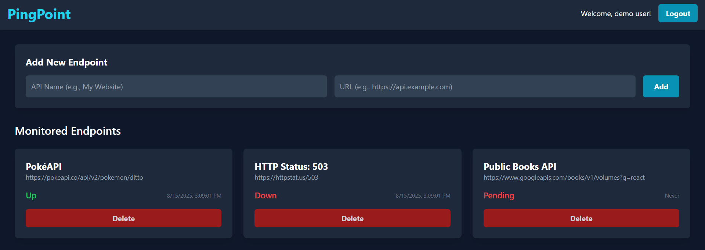

# PingPoint: Real-Time API Health Monitoring Dashboard

A full-stack, multi-user web application designed for developers to monitor the health and uptime of their critical API endpoints in real-time.

##  Live Demo

**[https://ping-point-jk.vercel.app/](https://ping-point-jk.vercel.app/)**

*(Note: The backend is hosted on a free Render instance, which may spin down after inactivity. The first request upon visiting might take up to 30 seconds to wake the server.)*

*Demo email: demo@pingpoint.app*

*Demo password: 12345* 

##  Application Preview

*(A screenshot of the main dashboard showing several monitored endpoints)*

---

##  Key Features

-   **Secure User Authentication:** Full authentication flow with user registration and login. Passwords are B-Hashed for security, and sessions are managed using JSON Web Tokens (JWT).
-   **Real-Time Monitoring:** An asynchronous backend worker (`node-cron`) runs every minute to ping user-defined URLs, providing up-to-date status information.
-   **Dynamic Dashboard:** A responsive, single-page application built with React that polls the backend to display the latest status (Up/Down) for each endpoint without requiring a page refresh.
-   **Full CRUD Functionality:** Authenticated users can Create, Read, Update, and Delete their own endpoints.
-   **Protected Routes & Data Isolation:** The backend API is secured with custom middleware, ensuring that users can only access and manage their own data.

---

##  Tech Stack & Architecture

This project utilizes the MERN stack with a decoupled frontend and backend architecture.

-   **Frontend:** React, Redux Toolkit, React Router, Tailwind CSS, Vite
-   **Backend:** Node.js, Express.js
-   **Database:** MongoDB with Mongoose
-   **Authentication:** JSON Web Tokens (JWT), bcrypt.js
-   **Asynchronous Jobs:** node-cron
-   **Deployment:**
    -   Frontend deployed on **Vercel**.
    -   Backend API deployed on **Render**.

### System Architecture
[User] <--> [Browser]
|
+--> [Frontend - React on Vercel]
| (Authenticated API Calls with JWT)
|
+--> [Backend - Node/Express on Render] <--> [MongoDB Atlas]
| ^
+-----> (Asynchronous Worker node-cron) --+ (Updates DB)
|
+-----> (Pings External User APIs)

##  License

This project is licensed under the MIT License - see the [LICENSE.md](LICENSE.md) file for details.

##  Contact

Jhugan Kartikey - [jkartikey.official@gmail.com](mailto:jkartikey.official@gmail.com)

Project Link: [https://github.com/jhugan-k/pingpoint](https://github.com/jhugan-k/pingpoint)
